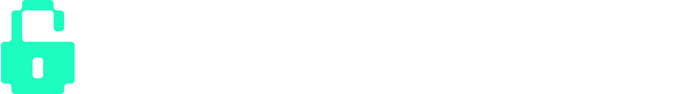

# Nest Thermostat Firmware Setup

[](https://buymeacoffee.com/codykociemba)
[](https://discord.gg/hackhouse)
[](https://github.com/codykociemba/NoLongerEvil-Thermostat/releases/tag/v1.0.0)

<div align="center">
  <a href="https://bounties.fulu.org/bounties/nest-learning-thermostat-gen-1-2">
    
  </a>
  <h2>🏆 FULU Bounty Winner 🏆</h2>
  <p><strong><a href="https://hackhouse.io">Hack House</a></strong> and this project are the official winners of the <strong><a href="https://bounties.fulu.org/bounties/nest-learning-thermostat-gen-1-2">FULU Bounty for Nest Learning Thermostat Gen 1/2</a></strong></p>
</div>

**Hardware Alternative:** If you're interested in the hardware side of things, check out [https://sett.homes](https://sett.homes) for a drop-in PCB replacement option.

---

## Installation Options

Choose the installation method that works best for you:

### Option 1: Hosted (GUI Installer) - **Recommended**

The easiest way to get started. Download our GUI installer that handles everything automatically.

📖 **[View Installation Guide](https://docs.nolongerevil.com/hosted/installation)**

### Option 2: Hosted (Manual)

If the GUI installer doesn't work for you, follow the manual installation steps below. This method uses command-line tools to flash the firmware.

### Option 3: Self-Hosted - **Advanced Users Only**

Host your own No Longer Evil server infrastructure. Requires technical expertise.

📖 **[View Self-Hosted Guide](https://docs.nolongerevil.com/self-hosted/overview)**

⚠️ **Warning:** This option is still a work in progress and may or may not function properly. Check out the [discussion here](https://github.com/codykociemba/NoLongerEvil-Thermostat/discussions/34) for more details.

---

## Manual Installation (Option 2)

This directory contains the tools and firmware needed to flash custom firmware to Nest Thermostat devices using the OMAP DFU (Device Firmware Update) interface.

### Prerequesites

You will need to have a Linux or MacOS computer available.

⚠️ Please verify your Nest is compatible at **[https://docs.nolongerevil.com/compatibility](https://docs.nolongerevil.com/compatibility)** - we currently only support Nest Generation 1 and 2 at the moment.

### How it Works

The custom firmware flashes the device with modified bootloader and kernel components that redirect all network traffic from the original Nest/Google servers to a server we specify. This server hosts a reverse-engineered replica of their API, allowing the thermostat to function independently while giving you complete control over your device data and settings.

By intercepting the communication layer, the thermostat believes it's communicating with the official Nest infrastructure, but instead connects to the No Longer Evil platform. This approach ensures full compatibility with the device's existing software while breaking free from Google's cloud dependency.

## Quick Start

### 1. Clone the Repository

```bash
git clone https://github.com/codykociemba/NoLongerEvil-Thermostat.git
cd NoLongerEvil-Thermostat
```

### 2. Install Prerequisites

Before building, you'll need to install some required packages:

#### Linux (Debian/Ubuntu)

```bash
sudo apt-get update
sudo apt-get install build-essential libusb-1.0-0-dev gcc pkg-config
```

#### macOS

First, install Xcode Command Line Tools:

```bash
xcode-select --install
```

Then install libusb using Homebrew (the build script will attempt to install this automatically if missing):

```bash
# Install Homebrew if you don't have it
/bin/bash -c "$(curl -fsSL https://raw.githubusercontent.com/Homebrew/install/HEAD/install.sh)"

# Install libusb
brew install libusb pkg-config
```

### 3. Build the omap_loader tool

```bash
chmod +x build.sh
./build.sh
```

The build script will automatically detect your operating system and build the appropriate binary.

### 4. Start the firmware installer

**IMPORTANT: You must start the installer script BEFORE rebooting the device.**

```bash
chmod +x install.sh
./install.sh
```

**Note for macOS:** You may need to grant USB permissions. If you encounter permission issues, check System Preferences → Security & Privacy.

The script will wait for the device to enter DFU mode.

### 5. Put your Nest device in DFU mode

Follow these steps carefully:

1. **Charge the device** - Ensure your Nest Thermostat is properly charged (at least 50% battery recommended)
2. **Remove from wall** - Remove the Nest from its back plate/wall mount
3. **Connect via USB** - Plug the Nest into your computer using a micro USB cable
4. **Wait for the installer** - Make sure the `install.sh` script is running and waiting
5. **Reboot the device** - Press and hold down on the display for 10-15 seconds until the device reboots
6. **DFU mode active** - Once it reboots, the device will enter DFU mode and the installer script will recognize it and begin flashing

The firmware installer will automatically detect the device and flash the custom bootloader (x-load, u-boot) and kernel (uImage).

### 6. Wait for the device to boot

After the firmware is flashed successfully, you should see our NLE logo on the device screen.

**Important:**
- Keep the device plugged in via USB
- Wait for the device to complete its boot sequence (this may take 3-4 minutes)
- Do not disconnect or power off the device during this time

### 7. Register your account

Once the device has fully rebooted:

1. Visit **[https://nolongerevil.com](https://nolongerevil.com)** in your web browser
2. **Register an account** (or sign in if you already have one)
3. Navigate to your **Dashboard**

You will see a "No devices" screen that prompts you for an entry code.

### 8. Link your device

To link your Nest device to your No Longer Evil account:

1. On your Nest device, navigate to: **Settings → Nest App → Get Entry Code**
2. The device will display a unique entry code
3. Enter this code on the No Longer Evil dashboard
4. Your device is now linked and ready to use!

## Security Considerations

This tool provides low-level access to the device's boot process. Use responsibly:

- Only use on devices you own
- Improper firmware can brick your device (Don't sue me bro)

## Credits & Acknowledgments

This project builds upon the excellent work of several security researchers and developers:

- **[grant-h](https://github.com/grant-h) / [ajb142](https://github.com/ajb142)** - [omap_loader](https://github.com/ajb142/omap_loader), the USB bootloader tool used to flash OMAP devices
- **[exploiteers (GTVHacker)](https://github.com/exploiteers)** - Original research and development of the [Nest DFU attack](https://github.com/exploiteers/NestDFUAttack), which demonstrated the ability to flash custom firmware to Nest devices gen 1 & gen 2
- **[FULU](https://bounties.fulu.org/)** and all bounty backers - For funding the [Nest Learning Thermostat Gen 1/2 bounty](https://bounties.fulu.org/bounties/nest-learning-thermostat-gen-1-2) and supporting the right-to-repair movement

Without their groundbreaking research, open-source contributions, and advocacy for device ownership rights, this work would not be possible. Thank you!

### Open Source Commitment

We are committed to transparency and the right-to-repair movement. The firmware images and backend API server code will be open sourced soon, allowing the community to audit, improve, and self-host their own infrastructure.

## References

- [OMAP Loader by ajb142](https://github.com/ajb142/omap_loader)
- [Nest DFU Attack by exploiteers](https://github.com/exploiteers/NestDFUAttack)
